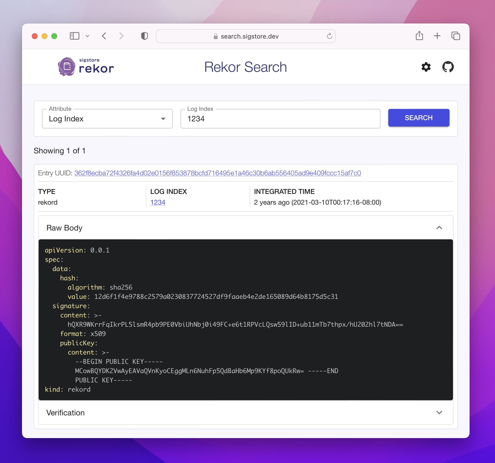

This repo contains a simple UI for searching Search the Rekor public transparency log.

https://search.sigstore.dev/



# Getting Started

First, run the development server:

```bash
npm run dev
```

Open [http://localhost:3000](http://localhost:3000) with your browser to see the result.

## Tests

### Unit Tests

Run all [Jest](https://jestjs.io/) and [React Testing Library](https://testing-library.com/docs/react-testing-library/intro) unit tests:

```bash
npm run test
```

Launches the test runner in the interactive watch mode.

Tests are co-located and live as closely to corresponding code as possible.

## Deploy

The app is based on [Next.JS](https://nextjs.org/) and is automatically built & deployed to GitHub Pages when pushing to the `main` branch.

## Internal Server Configuration

This app supports overriding of the default rekor server instance for those running private instances of the the sigstore stack.
Create a `.env.local` file at the root and include in it this environment variable

```properties
NEXT_PUBLIC_REKOR_DEFAULT_DOMAIN=https://privaterekor.sigstore.dev
```
