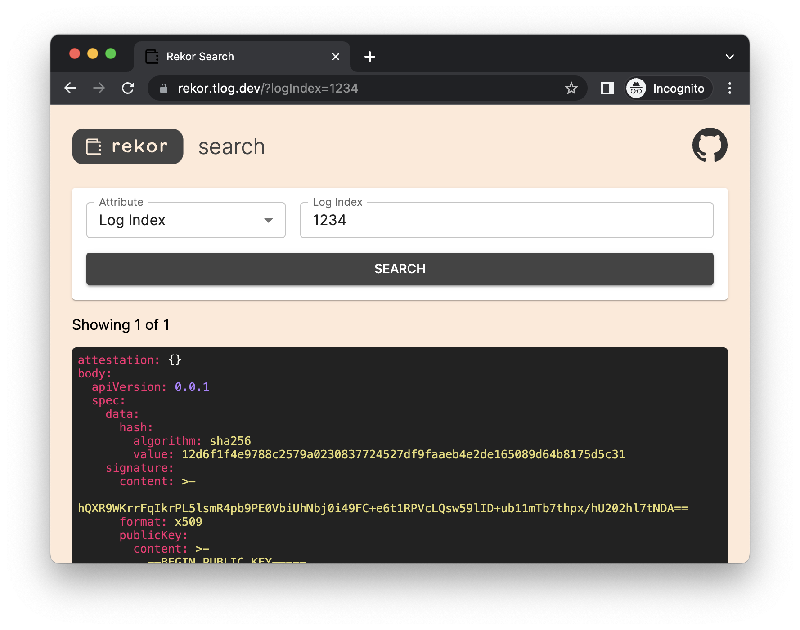

This repo contains a simple UI for searching Search the Rekor public transparency log.

https://search.sigstore.dev/



## Getting Started

First, run the development server:

```bash
pnpm dev
```

Open [http://localhost:3000](http://localhost:3000) with your browser to see the result.

## Deploy

The app is automatically built & deployed to Vercel when pushing to the `main` branch.
